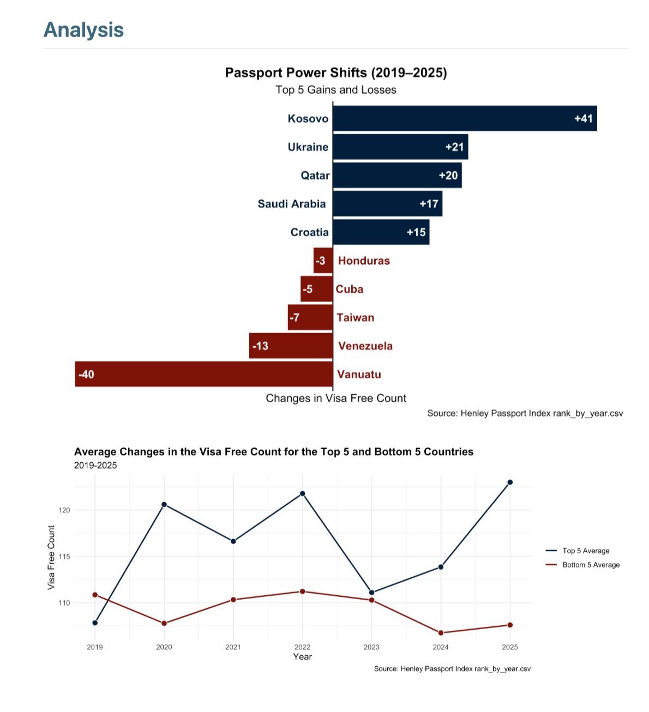
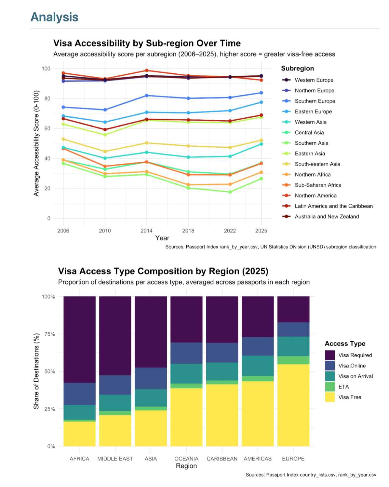

# Passport Strength Analysis

## Project Overview

This project analyzes global passport strength using visa-free access data from 2006–2025 to examine how international mobility varies across countries and UN-designated subregions. The objective is to quantify patterns in global travel freedom and identify structural drivers of mobility inequality through data analysis and visualization.

---

## Research Question

How has passport strength evolved across global regions over time, and what structural factors explain persistent disparities in international travel access?

---

## Data

- Time Span: 2006–2025  
- Geographic Scope: UN-designated global subregions  
- Key Variables:
  - Passport strength score
  - Visa-free destinations
  - Visa-required destinations
  - Visa-on-arrival
  - Electronic Travel Authorization (ETA)
  - Regional classifications

---

## Methodology

### 1. Data Cleaning & Preparation
- Standardized country and region naming conventions
- Aggregated country-level data into subregional averages
- Verified numeric consistency of accessibility scores
- Structured time-series dataset for longitudinal analysis

### 2. Exploratory Data Analysis
- Generated regional time-series trends (2006–2025)
- Compared distribution of accessibility categories across regions
- Identified structural stability and deviations over time

### 3. Visualization
- Line charts to examine temporal trends
- Stacked bar charts to analyze composition of visa categories
- Comparative analysis across seven global regions

---

## Key Findings

### 1. Persistent Regional Inequality (2006–2025)

Passport strength remains highly stable and geographically clustered over nearly two decades:

- Western Europe, Northern Europe, Northern America, and Australia & New Zealand consistently maintain scores above 90.
- Southern Asia and Sub-Saharan Africa remain largely below 40 throughout the period.
- Ranking positions show minimal movement across 20 years, indicating structural persistence in global mobility inequality.

Eastern Europe demonstrates gradual improvement over time, likely reflecting European Union expansion and Schengen integration. A temporary dip between 2018–2022 appears in Central and Southern Asia, potentially reflecting global COVID-related travel disruptions.

---

### 2. Structural Drivers of the Accessibility Gap

The stacked bar analysis highlights that inequality is primarily driven by differences in visa-free vs. visa-required access:

- European regions average over 50% visa-free access and under 25% visa-required destinations.
- Africa and the Middle East show approximately 55–60% visa-required destinations on average.
- Visa-on-arrival and online visa categories remain relatively stable across regions.
- Electronic Travel Authorization (ETA) represents a small share globally, reflecting its relatively recent adoption.

This suggests that structural inequality is largely driven by reciprocal visa-free agreements rather than incremental visa mechanisms.

---

### 3. Reciprocity and Institutional Lock-In

The long-term stability of rankings suggests that visa agreements operate reciprocally. Countries with strong passport access reinforce mobility agreements among similarly ranked nations, making upward movement difficult for lower-ranked passports. This institutional structure contributes to persistent inequality in global travel access.

---

## What This Project Demonstrates

- Ability to structure and analyze multi-country time-series data  
- Regional aggregation and comparative analysis  
- Clear visualization of structural global disparities  
- Translation of data into interpretable policy-relevant insights  

---
## Contributors

This project was originally developed as part of a collaborative academic assignment.

Contributors:
- Naya Ko  
- N'Avea Saint Louis  
- Alain Fornes  
- Tuna Korkmaz  

This repository represents Tuna Korkmaz’s portfolio version of the project, with refined documentation and presentation.

## Example Visualizations

### Regional Trend Over Time

### Visa Accessibility Composition by Region

